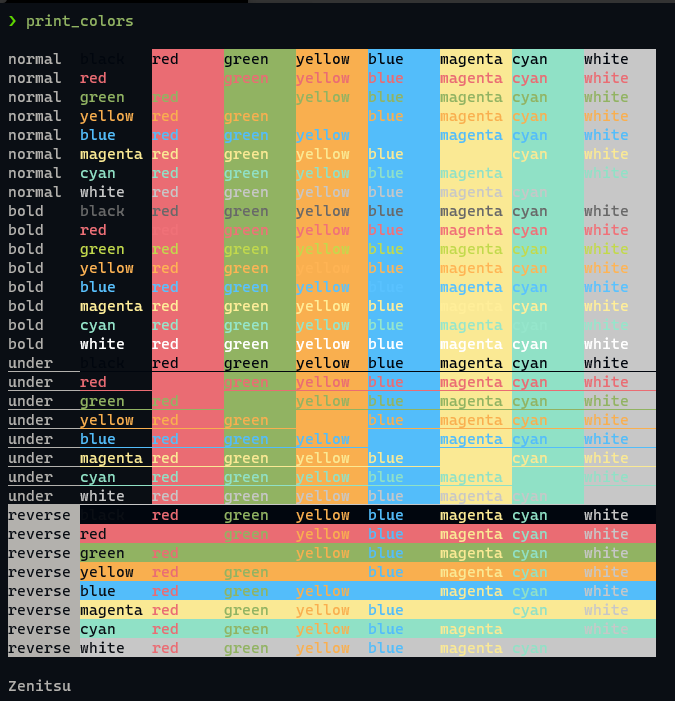
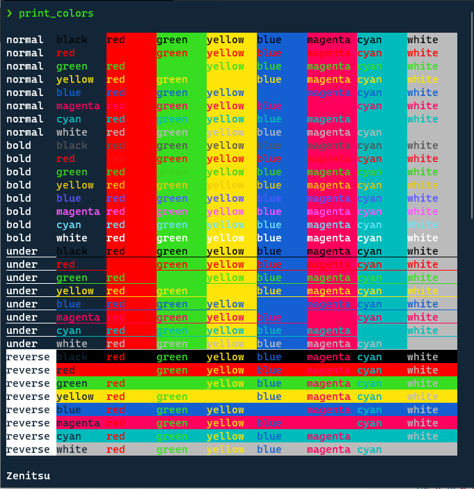
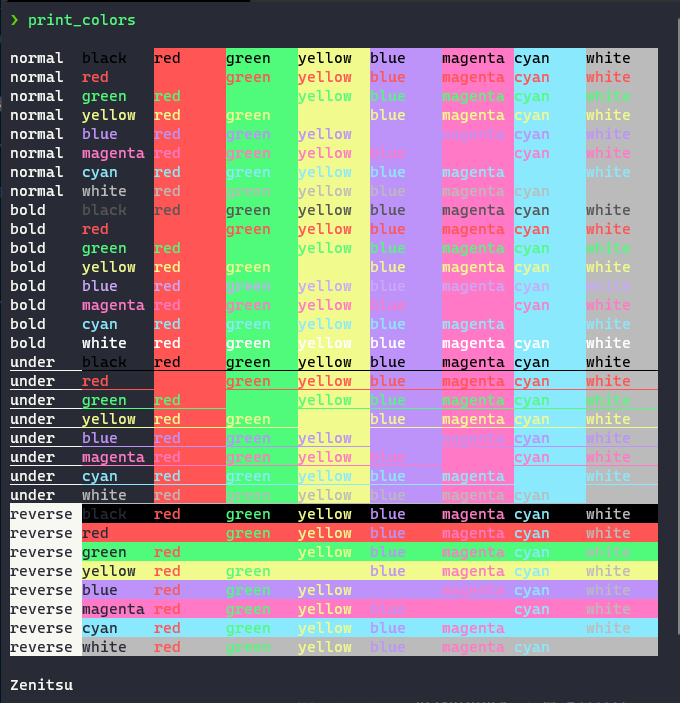
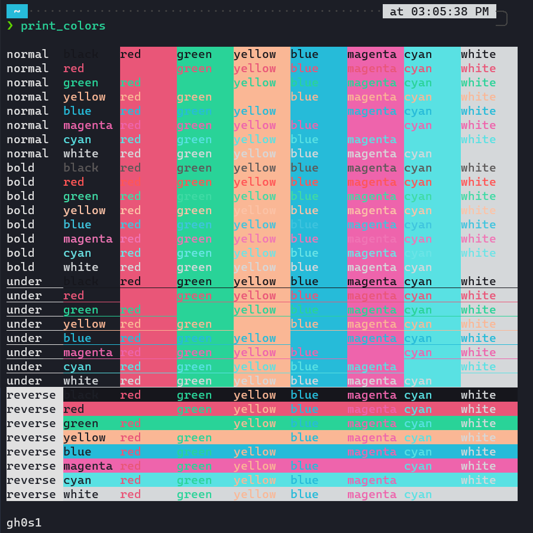
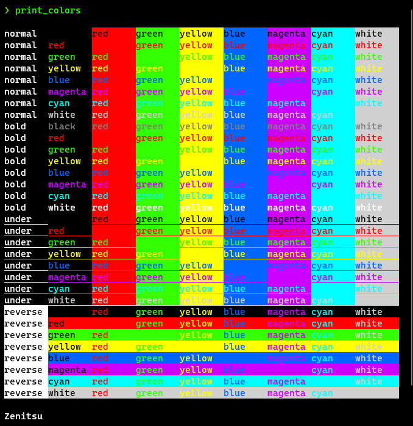

# Windows Terminal Themes

This repo lists (copied or slightly modified) color schemes for `Microsoft Windows Terminal`

- collected from various sources
- converted from other terminal emulator themes

## How to apply?

Copy the content of `JSON` file in the `colors` section into `schemes[]` file.
Set the ColorScheme 

## Color Schemes

|NAME|COLORS|
|:---:|:---:|
|**_ayu_dark_** [source](https://github.com/ayu-theme/ayu-colors)||
|**_Cobalt2_** [source](https://github.com/wesbos/cobalt2/tree/master/Cobalt2)||
|**_dracula_** [source](https://draculatheme.com)||
|**_horizon-dark_** [source](https://github.com/jolaleye/horizon-theme-vscode)||
|**_hyper_** [source](https://hyper.is)||
|**_iterm_**||

## Contributing

Bug reports and pull requests are welcome on GitHub at [microsoft-windows-terminal-themes](https://github.com/addy3494/microsoft-windows-terminal-themes) 
repository. This project is intended to be a safe, welcoming space for collaboration, and contributors are expected to 
adhere to the [Contributor Covenant](http://contributor-covenant.org) code of conduct.

  1. Fork it ( https://github.com/addy3494/microsoft-windows-terminal-themes/fork )
  1. Create your feature branch (`git checkout -b my-new-feature`)
  1. Commit your changes (`git commit -am 'Add some feature'`)
  1. Push to the branch (`git push origin my-new-feature`)
  1. Create a new Pull Request

## Author

* **gh0s1** - *Owner* - [gh0s1](https://github.com/addy3494)

## License

The project is available as open source under the terms of the [Apache License, Version 2.0](LICENSE)